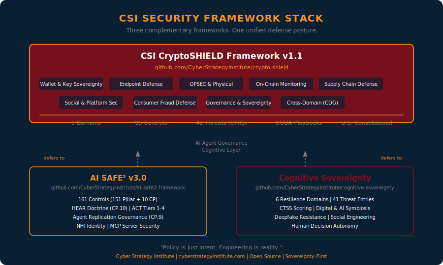

# CSI CryptoSHIELD Framework

**The open-source, sovereignty-first security doctrine for crypto holders, DeFi developers, and protocol teams: 42 threats, 95 controls, 9 domains, one engineering thesis: unknown code does not execute.**

[](CHANGELOG.md)
[](taxonomy/registry.json)
[](taxonomy/ctrs-scoring.md)
[](LICENSE)
[](LICENSE)
[](https://github.com/CyberStrategyInstitute/ai-safe2-framework)
[](https://github.com/CyberStrategyInstitute/cognitive-sovereignty)
[](00-cross-domain/README.md)
[](CHANGELOG.md)

**Sovereignty First. Deterministic Defense. Zero Unknown Code Execution.**

[Start Here](#who-this-is-for) | [Architecture](#architecture) | [Threat Taxonomy](#threat-taxonomy) | [9 Domains, 95 Controls](#9-domains-95-controls) | [OODA Playbook](#ooda-playbook) | [Companion Frameworks](#companion-frameworks) | [Toolkit](#toolkit)

---



---

## Who This Is For

Start here. Find your profile. Go directly to what matters.

| Profile | Entry Point | First Action |
|---------|-------------|--------------|
| **Individual holder** ($5K-$2M crypto) | [Tools: 30-Day Sprint](tools/30-day-hardening-sprint.md) | Complete Week 1 today: wallet sovereignty |
| **DeFi developer** | [Domain 06 (SCD)](06-supply-chain-defense/README.md) + [Domain 07 (AAS)](07-ai-agent-security/README.md) | SBOM your dependency stack |
| **Protocol security team** | [CTRS Scoring](taxonomy/ctrs-scoring.md) + [Threat Registry](taxonomy/registry-table.md) | Score your top 10 threat exposures |
| **Enterprise / CISO** | [FRAMEWORK-ALIGNMENT.md](FRAMEWORK-ALIGNMENT.md) | Run the compliance crosswalk |
| **Journalist / researcher** | [Research Notes](research/) | Start with [003: DPRK Attribution](research/003_dprk_attribution_analysis.md) |
| **Security contributor** | [CONTRIBUTING.md](CONTRIBUTING.md) | Review open issues and submission standards |

---

## What CryptoSHIELD Is For

$15 billion. That is the combined on-chain and consumer fraud loss figure for 2025: in a single year. The threat landscape that produced it is not a technology problem. It is an architecture problem.

Every major loss in 2025 shared a common root: single-point failure. One wallet exposed. One insider with unilateral key access. One npm package compromised on a developer machine that also ran a hot wallet. One phone call made under pressure that no multisig could stop because the architecture permitted it.

Detection-based security cannot fix single-point failure. You cannot alert your way to sovereignty. You have to engineer it out.

CryptoSHIELD is the engineering doctrine. Nine security domains. 95 specific controls. 42 threat IDs with machine-readable CTRS scores. A full OODA-loop playbook for incidents that detection missed. And a governance philosophy aligned with U.S. constitutional principles: not EU surveillance architecture.

The thesis: no unknown code runs. No unauthorized transaction signs. No coercion succeeds because the architecture makes single-point capitulation structurally impossible.

> "You cannot patch your way to sovereignty."

---

## The CTRS Top 10: Know What You're Facing

These are the 10 highest-scoring threats on the Crypto Threat Risk Score (CTRS) scale. If you implement controls for nothing else, implement controls for these.

| Rank | Threat ID | Name | CTRS | 2025 Impact |
|------|-----------|------|------|-------------|
| 1 | CS-FRD-01 | Pig Butchering / Financial Grooming | 20.0 | $7.2B U.S. losses (FBI IC3) |
| 1 | CS-SOC-06 | Forced Labor Compound Operations | 20.0 | 220,000+ trafficked operators |
| 3 | CS-WAL-04 | Malicious Signature (Permit2 / ERC-20) | 19.0 | 68% of DeFi losses via approvals |
| 3 | CS-SC-01 | NPM Package Hijacking | 19.0 | 500+ packages, 2.6B downloads/wk |
| 5 | CS-SC-02 | SDK / Library Poisoning | 18.0 | Ledger Connect Kit: $600K / 2hrs |
| 5 | CS-SC-03 | CI/CD Pipeline Compromise | 18.0 | Ultralytics YOLO11: Nov 2024 |
| 5 | CS-AI-02 | Prompt Injection (AI Agents) | 18.0 | Freysa: agent overridden via chat |
| 8 | CS-MAL-02 | InfoStealer / Remote Access Trojan | 17.5 | DPRK fake job pipeline primary vector |
| 8 | CS-DFI-03 | Bridge Exploit | 17.5 | $2.88B lifetime; Kelp DAO: $292M |
| 8 | CS-SC-04 | AI Model Backdoor | 17.5 | Ultralytics YOLO11 cryptomining |

Full scoring methodology: [taxonomy/ctrs-scoring.md](taxonomy/ctrs-scoring.md) | Human-readable threat table: [taxonomy/registry-table.md](taxonomy/registry-table.md)

---

## Architecture

CryptoSHIELD is organized around **9 Security Domains** covering every layer of the attack surface, from the physical body of the holder to the on-chain execution environment. For AI agent-specific risk governance, the framework defers to [AI SAFE² v3.0](https://github.com/CyberStrategyInstitute/ai-safe2-framework). For cognitive manipulation and social engineering resilience, it defers to the [Cognitive Sovereignty Framework](https://github.com/CyberStrategyInstitute/cognitive-sovereignty).

### The Three-Framework Stack

```
┌─────────────────────────────────────────────────┐
│          CSI CryptoSHIELD Framework v1.1         │
│   Crypto asset sovereignty, endpoint defense,    │
│   on-chain security, physical OPSEC, DeFi risk   │
├──────────────────────┬──────────────────────────┤
│   AI SAFE² v3.0      │  Cognitive Sovereignty    │
│  AI agent security   │   Framework (CSF)         │
│  Agentic governance  │  Cognitive manipulation   │
│  NHI identity mgmt   │  Social engineering       │
│  Swarm governance    │  Deepfake resilience      │
│  Memory integrity    │  Decision autonomy        │
└──────────────────────┴──────────────────────────┘
```

CryptoSHIELD covers what neither companion framework covers: the cryptoeconomic attack surface: wallets, keys, DeFi protocols, on-chain interactions, physical coercion of holders, supply chain compromise of Web3 infrastructure, and the $11B+ consumer fraud ecosystem targeting retail participants.

### 9 Security Domains

| # | Domain | Abbr. | Controls | Focus |
|---|--------|-------|----------|-------|
| 00 | Cross-Domain Sovereignty Governance | CDG | 5 | Constitutional alignment, sovereignty principles, governance structure |
| 01 | Wallet and Key Sovereignty | WKS | 10 | Self-custody, hardware wallets, multisig, seed security |
| 02 | Endpoint and Device Defense | EDD | 10 | Deterministic endpoint, dedicated signing, Zero Trust |
| 03 | OPSEC and Physical Security | OPS | 10 | Wrench attack prevention, identity decoupling, OSINT hygiene |
| 04 | Social Media and Platform Security | SMS | 15 | Account security, platform verification, DM hygiene |
| 05 | On-Chain Monitoring and Transaction Defense | OCM | 10 | Transaction simulation, approval monitoring, MEV protection |
| 06 | Supply Chain Defense | SCD | 10 | SBOM, dependency pinning, CI/CD isolation, binary analysis |
| 07 | AI Agent and Autonomous System Security | AAS | 10 | Defers to AI SAFE² v3.0 for full governance; crypto-specific controls here |
| 08 | Governance, Compliance, and Sovereignty | GCS | 10 | U.S. constitutional alignment, self-custody rights, regulatory awareness |
| 09 | Consumer Fraud and Financial Grooming Defense | CFD | 10 | Pig butchering, ATM fraud, recovery scams, fake platforms |
| **Total** | | | **95** | |

### The Deterministic Defense Principle

Every control in CryptoSHIELD traces back to one architectural commitment: **no unknown code executes; no unauthorized transaction signs**. Detection-first security assumes a threat has already entered your environment and attempts to identify it. CryptoSHIELD assumes the threat will always attempt entry and engineers an environment where execution is structurally impossible.

The four enforcement layers:

```
Layer 4: Governance Controls (GCS-* / CDG-*)
          ↓  Policy and constitutional alignment
Layer 3: Monitoring and Intelligence (OCM-* / SMS-*)
          ↓  Real-time awareness of anomalous activity
Layer 2: OPSEC and Social Defense (OPS-* / SMS-*)
          ↓  Eliminate the identifiable attack surface
Layer 1: Deterministic Endpoint (EDD-01 / WKS-* / SCD-*)
          ↓  Kernel-level: no unknown code runs. Ever.
```

---

## Threat Taxonomy

42 categorized threats across 11 categories, each with: Threat ID, OODA phase mapping, severity rating, trend data, false flag probability, and machine-readable metadata for SIEM and analytics integration.

Full taxonomy: [taxonomy/](taxonomy/) | Machine-readable registry: [taxonomy/registry.json](taxonomy/registry.json)

### Threat Category Summary

| Category | Threats | Highest Severity | 2025 Scale |
|----------|---------|-----------------|------------|
| Physical (CS-PHY) | 2 | CRITICAL | 72 incidents, $40.9M |
| Insider (CS-INS) | 3 | CRITICAL | $50M+ per incident |
| Social Engineering (CS-SOC) | 7 | CRITICAL | AI-enhanced 1,400% surge |
| Malware (CS-MAL) | 3 | HIGH | 778K wallets (clipboard) |
| Wallet (CS-WAL) | 5 | CRITICAL | 68% of losses via signatures |
| DeFi Protocol (CS-DFI) | 5 | CRITICAL | $2.88B bridges lifetime |
| Supply Chain (CS-SC) | 4 | CRITICAL | 500+ npm packages, 2.6B DL/wk |
| AI Agent (CS-AI) | 5 | CRITICAL | 8-12% DeFi volume by Q1 2026 |
| Market Manipulation (CS-MKT) | 3 | HIGH | Systemic/structural |
| Financial Fraud (CS-FRD) | 4 | CRITICAL | $7.2B pig butchering (US 2025) |
| Sovereignty (CS-SOV) | 2 | CRITICAL | Regulatory: courts pushing back |
| Extortion (CS-EXT) | 1 | HIGH | $813M ransomware (2024) |

### CTRS: Crypto Threat Risk Scoring

CryptoSHIELD uses the **Crypto Threat Risk Score (CTRS)**: a five-component weighted severity formula adapted from the CSF's CTSS model, calibrated for cryptoeconomic threat context.

```
CTRS = (L×0.25 + Ia×0.30 + R×0.20 + D×0.15 + RecD×0.10) × 20
```

| Component | Description | Weight |
|-----------|-------------|--------|
| Likelihood (L) | Probability of occurrence (0-5) | 0.25 |
| Impact on Assets (Ia) | Financial and sovereignty impact (0-5) | 0.30 |
| Reach (R) | Scale of affected population (0-5) | 0.20 |
| Detection Difficulty (D) | Evasion capability (0-5; higher = harder) | 0.15 |
| Recovery Difficulty (RecD) | Reversibility on-chain (0-5; higher = harder) | 0.10 |

Range: 0-100 | Critical ≥ 80 | High ≥ 70 | Elevated ≥ 60

**Top 5 CTRS Threats:**

| Rank | Threat ID | Name | CTRS |
|------|-----------|------|------|
| 1 | CS-FRD-01 | Pig Butchering / Financial Grooming | 92 |
| 2 | CS-PHY-01 | Physical Kidnapping / Coercion | 90 |
| 3 | CS-INS-03 | DPRK Wagemole Infiltration | 88 |
| 4 | CS-AI-04 | AI Swarm Coordinated Attack | 87 |
| 5 | CS-WAL-01 | Seed Phrase Extraction | 86 |

Full CTRS rankings: [taxonomy/ctrs-scoring.md](taxonomy/ctrs-scoring.md)

---

## 9 Domains, 95 Controls

### Domain 00: Cross-Domain Sovereignty Governance

> Sovereignty is not a feature. It is the architecture.

The foundational governance layer that every other domain inherits from. Establishes the U.S. constitutional alignment, self-custody rights framework, and non-negotiable sovereignty principles that cannot be traded away for compliance convenience.

- CDG-01: Sovereignty-First Policy Declaration
- CDG-02: U.S. Constitutional Alignment Protocol
- CDG-03: CBDC Non-Adoption Commitment
- CDG-04: Self-Custody Rights Documentation
- CDG-05: Annual Sovereignty Architecture Review

[Full domain specification →](00-cross-domain/README.md)

---

### Domain 01: Wallet and Key Sovereignty (WKS)

> Your keys, your crypto. Not your keys, not your crypto. No exceptions.

| Control | Priority |
|---------|----------|
| WKS-01: Hardware wallet for all holdings >$1K | CRITICAL |
| WKS-02: Multisig with geographic diversity (2-of-3 minimum) | CRITICAL |
| WKS-03: Tiered timelock: 72h for small protocols; 7-day for >$10M TVL | CRITICAL |
| WKS-04: Seed phrase offline: metal backup, never digital | CRITICAL |
| WKS-05: No blind signing: verify raw transaction before signing | CRITICAL |
| WKS-06: Independent address verification on separate device | HIGH |
| WKS-07: Token approval revocation (Revoke.cash audit cycle) | HIGH |
| WKS-08: Permit scam awareness: never sign unsolicited EIP-2612 | HIGH |
| WKS-09: Cold wallet for 90%+ holdings | CRITICAL |
| WKS-10: Watch-only wallet for household members | HIGH |

[Full domain specification →](01-wallet-key-sovereignty/README.md)

---

### Domain 02: Endpoint and Device Defense (EDD)

> The endpoint is the perimeter. Deterministic defense means no unknown code runs. Ever.

| Control | Priority |
|---------|----------|
| EDD-01: Kernel-level default-deny (Warden/Zero Trust model) | CRITICAL |
| EDD-02: Dedicated signing device: no general browsing | CRITICAL |
| EDD-03: Verified software only: SBOM verification for devs | CRITICAL |
| EDD-04: Anti-clipboard-hijack: manual address verification | CRITICAL |
| EDD-05: Browser extension audit: minimize for signing sessions | HIGH |
| EDD-06: OS hardening: minimal attack surface | HIGH |
| EDD-07: EDR as supplemental (not primary) defense layer | MEDIUM |
| EDD-08: Network isolation for signing operations | HIGH |
| EDD-09: Physical security of signing device | HIGH |
| EDD-10: App allowlisting: code-signed binaries only | CRITICAL |

> **Architectural Note:** Domain 02 maps directly to the Warden kernel-level containment model. Unknown executables do not run. Period. No behavioral analysis of unknown code is required because unknown code never executes. This is the difference between detection-first security and deterministic prevention.

[Full domain specification →](02-endpoint-device-defense/README.md)

---

### Domain 03: OPSEC and Physical Security (OPS)

> Assume your public digital footprint can be stitched into a physical map by anyone with $50 and a weekend.

72 verified wrench attacks in 2025. The OSINT-to-coercion kill chain is repeatable and well-documented. The attack does not require hacking your wallet. It requires finding your address.

| Control | Priority |
|---------|----------|
| OPS-01: Zero public disclosure of holdings | CRITICAL |
| OPS-02: Decouple identity from on-chain (no ENS to real name) | CRITICAL |
| OPS-03: Address non-reuse: new address per transaction | HIGH |
| OPS-04: OSINT self-audit: quarterly geotag and identity scan | HIGH |
| OPS-05: Pre-scripted physical incident response plan | CRITICAL |
| OPS-06: Coercion decoy wallet: visible small balance in accessible wallet | HIGH |
| OPS-07: Family OPSEC: separate accounts, limited knowledge | CRITICAL |
| OPS-08: Geolocation hygiene: EXIF strip, disable crypto app location | HIGH |
| OPS-09: Surveillance detection pattern recognition | MEDIUM |
| OPS-10: Duress protocol: pre-agreed distress signal to trusted contact | HIGH |

[Full domain specification →](03-opsec-physical-security/README.md)

---

### Domain 04: Social Media and Platform Security (SMS)

> AI-powered impersonation attacks surged 1,400% YoY in 2025. The era of detecting scams via typos is over.

| Control | Priority |
|---------|----------|
| SMS-01: Hardware 2FA (YubiKey) for all exchange and social accounts | CRITICAL |
| SMS-02: Remove phone number from X/social (eliminate SIM-swap vector) | CRITICAL |
| SMS-03: Monthly OAuth audit: revoke all non-essential connected apps | HIGH |
| SMS-04: Dedicated recovery email with strong 2FA | HIGH |
| SMS-05: URL verification: never click links to crypto frontends | CRITICAL |
| SMS-06: No unsolicited DM trust: job offers, partnerships, giveaways | CRITICAL |
| SMS-07: Monthly social engineering awareness drill | HIGH |
| SMS-08: Cross-verify announcements on-chain, not via social posts | HIGH |
| SMS-09: Real-time phishing detection (Scam Sniffer or equivalent) | HIGH |
| SMS-10: Influencer skepticism: apply Rotator Effect analysis | MEDIUM |
| SMS-11: Manual URL entry: bookmark directly or type; never click | HIGH |
| SMS-12: Pre-transaction platform verification stack | CRITICAL |
| SMS-13: 10-Day Rule for new platforms: mandatory waiting period | CRITICAL |
| SMS-14: Fee demand alert protocol: any withdrawal unlock fee = fraud | CRITICAL |
| SMS-15: Recovery scam awareness: no service can reverse blockchain tx | HIGH |

[Full domain specification →](04-social-media-platform-security/README.md)

---

### Domain 05: On-Chain Monitoring and Transaction Defense (OCM)

| Control | Priority |
|---------|----------|
| OCM-01: Transaction simulation: mandatory execution GATE, not optional check (Tenderly) | CRITICAL |
| OCM-02: Real-time wallet alert on any unexpected outgoing transaction | HIGH |
| OCM-03: Token approval monitoring: auto-revoke after 30 days inactivity | HIGH |
| OCM-04: Mempool awareness: private RPC for large transactions | HIGH |
| OCM-05: MEV protection routing (Flashbots Protect or private mempool) | MEDIUM |
| OCM-06: Address poisoning detection: full hex verification | HIGH |
| OCM-07: Bridge risk assessment: avoid single-verifier designs | HIGH |
| OCM-08: Smart contract audit verification: recency check required | HIGH |
| OCM-09: AI-assisted anomaly detection for managed wallets | HIGH |
| OCM-10: EIP-712 structured data full comprehension before signing: `eth_sign` = never use | CRITICAL |

[Full domain specification →](05-on-chain-monitoring/README.md)

---

### Domain 06: Supply Chain Defense (SCD)

> Shai-Hulud (September 2025): 500+ npm packages compromised. 2.6 billion weekly downloads. Targeting Ethereum, Bitcoin, Solana, Tron, Litecoin, Bitcoin Cash wallets. The supply chain is not a perimeter concern. It is a kill chain.

| Control | Priority |
|---------|----------|
| SCD-01: SBOM enforcement for all production code | CRITICAL |
| SCD-02: Cryptographic signatures required for all third-party packages | CRITICAL |
| SCD-03: CI/CD secret isolation: vault with ephemeral tokens | CRITICAL |
| SCD-04: Binary analysis beyond SCA/SAST: detect compiled tampering | HIGH |
| SCD-05: Third-party commercial software security assessment | HIGH |
| SCD-06: Regular adversarial supply chain simulation testing | HIGH |
| SCD-07: Package lock pinning: alert on unexpected version changes | CRITICAL |
| SCD-08: AI model provenance: verify hashes before integration | HIGH |
| SCD-09: Post-install hook blocking: `--ignore-scripts` flag or global `.npmrc` policy | HIGH |
| SCD-10: Full security exam before every production deployment | HIGH |

[Full domain specification →](06-supply-chain-defense/README.md)

---

### Domain 07: AI Agent and Autonomous System Security (AAS)

> This domain provides crypto-specific AI agent controls. Full agentic AI governance: memory integrity, swarm governance, HEAR Doctrine, NHI identity management, ACT tiers: is covered by [AI SAFE² v3.0](https://github.com/CyberStrategyInstitute/ai-safe2-framework).

By Q1 2026, AI agent wallets represented 8-12% of EVM DeFi transaction volume. The Freysa exploit demonstrated that an agent with a hardcoded "never transfer funds" directive can be social-engineered into fund transfer by redefining its operational logic. The ClawJacked vulnerability class enabled remote takeover of self-hosted trading agents via WebSocket flaws.

| Control | Priority |
|---------|----------|
| AAS-01: Keyless agent architecture: agents never hold private keys | CRITICAL |
| AAS-02: Memory integrity monitoring: hash verification of vector DB | CRITICAL |
| AAS-03: Prompt injection hardening: immutable core instructions | CRITICAL |
| AAS-04: Agent wallet isolation: separate minimal-balance wallets per strategy | HIGH |
| AAS-05: Testnet simulation first: no mainnet deployment without sandbox testing | HIGH |
| AAS-06: Hard transaction rate limits per time window | CRITICAL |
| AAS-07: Real-time agent behavior anomaly detection | HIGH |
| AAS-08: Tool call allowlisting: strict permitted contract/endpoint list | CRITICAL |
| AAS-09: Oracle diversity: never rely on single price feed | HIGH |
| AAS-10: Swarm isolation: no shared memory between swarm members | HIGH |

For full agentic AI governance: **Pillar 1 (Sanitize and Isolate)** for agent input hardening, **CP.5.MCP** for MCP server security, **CP.9** for agent replication governance, **CP.10 (HEAR Doctrine)** for cryptographically enforced human override, and **ACT Tier Classification** to determine what governance tier your agent requires: all in [AI SAFE² v3.0 →](https://github.com/CyberStrategyInstitute/ai-safe2-framework)

[Full domain specification →](07-ai-agent-security/README.md)

---

### Domain 08: Governance, Compliance, and Sovereignty (GCS)

> FinCEN's pattern of regulatory overreach has been consistently challenged and defeated in U.S. courts. The Fifth Circuit overturned Tornado Cash sanctions. CTA enforcement was blocked nationwide. Self-custody rights are constitutional. CSI's position: AML/KYC at CEX entry/exit is legitimate. Surveillance of self-custodied wallets is not.

| Control | Priority |
|---------|----------|
| GCS-01: Self-custody first policy: all significant holdings self-custodied | CRITICAL |
| GCS-02: CBDC resistance protocol: no surveillance-enabled digital currency | CRITICAL |
| GCS-03: Legal awareness: track FinCEN/SEC/CFTC; know Fifth Circuit rulings | HIGH |
| GCS-04: Minimal KYC surface: KYC only at regulated CEX entry/exit | HIGH |
| GCS-05: Vendor sovereignty assessment: evaluate all custody services | HIGH |
| GCS-06: Documented incident response plan: digital, physical, regulatory | CRITICAL |
| GCS-07: DAO governance participation: prevent single-actor protocol control | MEDIUM |
| GCS-08: Open source preference: auditable over black-box | HIGH |
| GCS-09: Privacy tool assessment: ZK proofs, privacy coins per legal context | MEDIUM |
| GCS-10: Annual framework review: update against current threat landscape | HIGH |

[Full domain specification →](08-governance-compliance-sovereignty/README.md)

---

### Domain 09: Consumer Fraud and Financial Grooming Defense (CFD)

> The FBI IC3 2025 Annual Report: $11.366 billion in U.S. crypto fraud losses in a single year. $7.2 billion from pig butchering alone. This dwarfs on-chain protocol exploits nearly 3:1. And 78% of active victims have no idea they are being scammed.

This domain was absent from most crypto security frameworks. It covers the $15B+ annual attack surface that targets retail participants through social engineering, fake platforms, and psychological manipulation: not smart contract exploits.

For cognitive manipulation defense, social engineering resilience, and decision autonomy under AI-enhanced deception: [Cognitive Sovereignty Framework →](https://github.com/CyberStrategyInstitute/cognitive-sovereignty)

| Control | Priority |
|---------|----------|
| CFD-01: Platform legitimacy stack check (DFPI + CryptoScamDB + Chainabuse) | CRITICAL |
| CFD-02: Unsolicited investment offer zero trust | CRITICAL |
| CFD-03: "Profitable test withdrawal" pattern recognition | CRITICAL |
| CFD-04: Fee demand = exit signal | CRITICAL |
| CFD-05: ATM crypto transaction refusal | CRITICAL |
| CFD-06: Elder household protocol: buddy system for large transfers | HIGH |
| CFD-07: Recovery scam firewall: IC3/FBI/licensed forensics only | HIGH |
| CFD-08: AI persona detection: out-of-band verification | HIGH |
| CFD-09: Group chat investment protocol: no decisions based on chat consensus | HIGH |
| CFD-10: Platform custodial assessment: can you verify balance on-chain? | CRITICAL |

[Full domain specification →](09-consumer-fraud-defense/README.md)

---

## OODA Playbook

CryptoSHIELD applies military OODA loop discipline to every threat response. The playbook provides pre-planned, stress-tested decision protocols for each threat category: eliminating improvisation under coercion or cognitive load.

**The False Flag / Fall Guy Filter** is baked into every OODA-Orient phase. Before accepting any official attribution (DPRK, external hack, smart contract bug), apply the insider-threat checklist. CSI's multi-pass analysis of LNDFi, Radiant Capital, Bybit, and Drift Protocol consistently shows: where admin key access exists, insider-first hypothesis must be exhausted before accepting state-actor attribution.

[Full OODA Playbook →](OODA-PLAYBOOK.md)

**Quick-reference by threat category:**

| Threat | Observe | Orient | Decide | Act |
|--------|---------|--------|--------|-----|
| Physical coercion | Monitor OSINT exposure | Assess surveillance indicators | Activate OPS-05/06 protocol | Execute duress plan |
| Wallet compromise | Alert: unexpected tx | Attribution: insider vs. external | Revoke approvals immediately | Migrate to clean cold wallet |
| Protocol exploit | On-chain anomaly detection | False flag analysis | Evidence preservation | Engage forensics + disclosure |
| Social engineering | Unsolicited contact signal | Authority/urgency/unusual-channel check | Apply SMS-06, SMS-13 | Report to IC3 + Chainabuse |
| Supply chain | Dependency version change alert | Binary analysis | Rollback/isolate | SBOM update + patch |

[Detailed response playbooks →](playbooks/)

---

## Research Corpus

Seven deep-dive research notes grounding every threat taxonomy entry in documented evidence. Multi-pass analysis across 80+ CSI Weekly Crypto Security Truths issues (July 2024 – May 2026) plus incident-specific analyses from 2021 onward.

| Note | Title | Key Finding |
|------|-------|-------------|
| [001](research/001_wrench_attack_epidemic.md) | The Wrench Attack Epidemic | OSINT-to-coercion kill chain fully repeatable; physical threat is now primary risk for high-net-worth holders |
| [002](research/002_rotator_effect.md) | The Rotator Effect: Capital Extraction Architecture | Coordinated multi-vector playbook; FUD, tokenomics weaponization, MEV, influencer coordination: systemic, not isolated |
| [003](research/003_dprk_attribution_analysis.md) | DPRK Attribution: Nuance Over Narrative | Insider-first hypothesis must precede state-actor attribution; Wagemole pattern is social engineering, not zero-day |
| [004](research/004_ai_agent_attack_surface.md) | AI Agent Attack Surface 2025-2026 | Memory poisoning, prompt injection, swarm attacks now operational; refer to AI SAFE² for full governance |
| [005](research/005_supply_chain_vectors.md) | Supply Chain: The Invisible Compromise Layer | 1,300% rise 2021-2023; Shai-Hulud worm; npm, CI/CD, SDK poisoning: all documented with kill chains |
| [006](research/006_pig_butchering_anatomy.md) | Pig Butchering: Full Anatomy | Fee escalation cycle map; forced labor link; $7.2B US 2025; AI-enhanced persona makes traditional detection fail |
| [007](research/007_false_flag_forensics.md) | False Flag Forensics | Weighted indicator set for attribution analysis; 10 historical case applications; the fall-guy pattern documented |

---

## Companion Frameworks

CryptoSHIELD is the third pillar of the CSI framework triad. All three are required for comprehensive coverage.

| Framework | Scope | What It Protects |
|-----------|-------|-----------------|
| **CryptoSHIELD** (this repo) | Cryptoeconomic attack surface | Wallets, keys, DeFi, on-chain, physical coercion, consumer fraud |
| [AI SAFE² v3.0](https://github.com/CyberStrategyInstitute/ai-safe2-framework) | Agentic AI governance | AI agents, swarms, NHIs, memory integrity, runtime governance |
| [Cognitive Sovereignty Framework](https://github.com/CyberStrategyInstitute/cognitive-sovereignty) | Human cognitive layer | Manipulation resistance, decision autonomy, deepfake resilience |

**The integration logic:**

A well-governed crypto AI trading agent (AI SAFE²) operating on a cognitively sovereign operator (CSF) running on a deterministic endpoint (CryptoSHIELD) is the complete defense stack. Compromising any one layer compromises the mission. All three are required.

---

## Regulatory Alignment (U.S., Sovereignty-First)

CryptoSHIELD is aligned with U.S. constitutional principles and the January 2025 Executive Order protecting self-custody rights and prohibiting CBDC: not EU MiCA surveillance architecture.

**Key judicial precedents supporting the sovereignty-first position:**

- **Tornado Cash Sanctions Overturned:** Fifth Circuit (November 2024) ruled immutable smart contracts are not "property" under IEEPA. OFAC removed sanctions March 2025.
- **CTA Enforcement Blocked:** Multiple federal courts blocked FinCEN's Corporate Transparency Act enforcement nationwide (January 2025).
- **FinCEN Real Estate Rule Struck Down:** Treasury's reporting rule exceeded statutory authority.
- **SEC Retreat:** March 2026 SEC/CFTC joint interpretation confirmed most crypto assets are NOT securities.
- **GENIUS Act:** Signed into law: reserve-backed stablecoin framework, AML at CEX boundaries only. Innovation-preserving approach.

CSI position: AML/KYC compliance at CEX entry/exit points is legitimate and workable. Monitoring of self-custodied wallets, private transactions, or implementing CBDC-style spending controls is unconstitutional and will be resisted through every available legal mechanism.

---

## Repository Structure

```
/
├── .github/                     # CI/CD Workflows and Issue Templates
├── 00-cross-domain/             # Sovereignty Governance OS
├── 01-wallet-key-sovereignty/   # WKS: 10 Controls
├── 02-endpoint-device-defense/  # EDD: 10 Controls (Deterministic Endpoint)
├── 03-opsec-physical-security/  # OPS: 10 Controls (Wrench Attack Defense)
├── 04-social-media-platform-security/  # SMS: 15 Controls (AI-Enhanced Deception)
├── 05-on-chain-monitoring/       # OCM: 10 Controls (Transaction Defense)
├── 06-supply-chain-defense/      # SCD: 10 Controls (NPM, CI/CD, SDK)
├── 07-ai-agent-security/         # AAS: 10 Controls (defers to AI SAFE²)
├── 08-governance-compliance-sovereignty/  # GCS: 10 Controls (Sovereignty-First)
├── 09-consumer-fraud-defense/    # CFD: 10 Controls (Pig Butchering, ATM)
├── taxonomy/                    # 42-Entry Threat Registry (YAML + JSON)
│   ├── registry.json            # Machine-readable master registry
│   ├── ctrs-scoring.md          # Crypto Threat Risk Scoring model
│   ├── threat-architecture.md   # Attack surface layer model
│   └── [category].md            # Per-category threat specifications
├── playbooks/                   # OODA Response Playbooks per Threat Class
├── metadata/                    # JSON schemas for SIEM/analytics integration
│   ├── threat-event-schema.json # Event schema for intelligence feeds
│   └── control-schema.json      # Control definition schema
├── research/                    # 7 Deep-Dive Research Notes
├── intelligence/                # Weekly intelligence structure templates
├── tools/                       # Reference tools and operational checklists
│   ├── osint-self-audit.md
│   ├── token-approval-guide.md
│   └── platform-verification-stack.md
├── assets/                      # Visual maps and diagrams
├── OODA-PLAYBOOK.md             # Full OODA Loop Defensive Playbook
├── FRAMEWORK-ALIGNMENT.md      # Cross-framework alignment mapping
├── CONTRIBUTING.md
├── CHANGELOG.md
└── README.md                    # You are here
```

---

## Toolkit

Four deliverables available from CSI for operational deployment of CryptoSHIELD:

| Asset | Description | Access |
|-------|-------------|--------|
| Framework Taxonomy | 42 threats + 95 controls: JSON/MD with CTRS scoring | Free (this repo) |
| [Sovereignty Self-Assessment](tools/sovereignty-self-assessment.md) | 100-point self-audit: domain breakdowns, tier classification | Free (this repo) |
| Blockchain Ranger Handbook | Field manual: task, conditions, standards per threat in military format | Coming Q3 2026 |
| 52-Card Threat Intelligence Deck | One card per threat: kill chain, CTRS, decisive countermeasure | Coming Q3 2026 |
| [False Flag Forensics Report](research/007_false_flag_forensics.md) | FFAP methodology: weighted attribution indicators, 10 case applications | Seed doc live |
| 30-Part LinkedIn Series | Framework distributed as a daily crypto security education campaign | Coming Q3 2026 |
| Congressional Brief | HSGAC/House Financial Services submission: U.S. crypto security policy | Coming Q3 2026 |
| CryptoSHIELD MCP Server | API-accessible threat registry and control lookup via bearer token | Coming Q4 2026 |
| [30-Day Hardening Sprint](tools/30-day-hardening-sprint.md) | Week-by-week individual holder implementation roadmap | Free (this repo) |

---

## 30-Day Individual Hardening Sprint

### Week 1: Wallet Sovereignty
- Move 90%+ of holdings to hardware wallet cold storage (WKS-01, WKS-09)
- Set up multisig for holdings >$50K with geographically separate signers (WKS-02)
- Audit and revoke all token approvals on Revoke.cash (WKS-07)
- Back up seed phrase on metal; destroy all digital copies (WKS-04)
- Enable 72-hour timelock on governance wallets (WKS-03)

### Week 2: Device and Endpoint
- Install kernel-level Zero Trust endpoint protection (EDD-01)
- Designate dedicated signing device; no general browsing (EDD-02)
- Audit and remove all non-essential browser extensions (EDD-05)
- Establish clipboard verification habit for every outgoing transaction (EDD-04)

### Week 3: Social and Physical OPSEC
- Remove phone number from all social media accounts (SMS-02)
- Enable YubiKey 2FA on all exchange and social accounts (SMS-01)
- Decouple ENS/social identity from wallet addresses (OPS-02)
- Conduct OSINT self-audit; remove identifiable location information (OPS-04)
- Write physical coercion/emergency response plan (OPS-05)

### Week 4: Monitoring and Intelligence
- Set up wallet monitoring alerts for outgoing transactions (OCM-02)
- Subscribe to CSI Weekly, Scam Sniffer, ZachXBT, CertiK feeds
- Test transaction simulation workflow (OCM-01)
- Verify all held platforms against CFD-01 stack (DFPI, CryptoScamDB, Chainabuse)

---

## Get Involved / Stay Current

**CSI Weekly Digest:** Intelligence briefings on the active crypto threat landscape: new incidents, CTRS score updates, control recommendations. Subscribe at [cyberstrategyinstitute.com](https://cyberstrategyinstitute.com).

**AI SAFE² Framework:** If you are deploying AI agents in DeFi, the CryptoSHIELD Domain 07 controls are the starting point. The full governance OS: 161 controls, HEAR Doctrine, ACT Tiers, MCP server security: lives at [github.com/CyberStrategyInstitute/ai-safe2-framework](https://github.com/CyberStrategyInstitute/ai-safe2-framework).

**Cognitive Sovereignty Framework:** Social engineering, deepfake manipulation, and AI-era cognitive threats are governed at [github.com/CyberStrategyInstitute/cognitive-sovereignty](https://github.com/CyberStrategyInstitute/cognitive-sovereignty).

---

## Recognition and Coverage

*This section is a living record of citations, coverage, and deployments.*

**Cited By:** [Open for community submissions: submit a PR if you've cited CryptoSHIELD in research, policy, or technical documentation]

**Used By:** [Protocol teams, security researchers, and individual holders using CryptoSHIELD in production: add your org via PR]

**Media Coverage:** [Press coverage and podcast appearances referencing CryptoSHIELD: submit via issue]

---

## Contributing

CryptoSHIELD is a living framework updated against the active threat landscape. Contributions must meet the same adversarial-reproduction standard applied to the initial framework: independent analysts using the same data and methodology must arrive at compatible assessments.

**How to contribute:**
- New Threat Entry: [.github/ISSUE_TEMPLATE/new-threat-entry.md](.github/ISSUE_TEMPLATE/new-threat-entry.md)
- Control Update: [.github/ISSUE_TEMPLATE/control-update.md](.github/ISSUE_TEMPLATE/control-update.md)
- Research Submission: Add peer-testable evidence to `/research/` with full sourcing and CTRS scoring justification

[Full Contributing Guide →](CONTRIBUTING.md)

---

## Citation

```bibtex
@misc{cryptoshield_framework_2026,
  title   = {CSI CryptoSHIELD Framework v1.1: Crypto Sovereignty, Hardened Intelligence, and Endpoint-Level Defense},
  author  = {Sullivan, Vincent and {Cyber Strategy Institute}},
  year    = {2026},
  month   = {May},
  publisher = {Cyber Strategy Institute},
  url     = {https://github.com/CyberStrategyInstitute/crypto-shield},
  note    = {Version 1.1. Sovereignty-First Architecture. 42 Threat Categories, 95 Controls, 9 Security Domains.}
}
```

---

## Licensing

**Code (MIT License):** Applies to JSON schemas, scripts, tools, and all code files. Use commercially, modify freely.

**Framework/Docs (CC-BY-SA 4.0):** Applies to methodology text, domain definitions, threat taxonomy, and documentation. Share with attribution; public derivatives must share back under this same license.

Managed by Cyber Strategy Institute.
Copyright © 2025-2026. All Rights Reserved.

---

> "You cannot patch your way to sovereignty."
> "Detection is a strategy of hope. Certainty is a strategy of engineering."
> "Never build an engine you cannot kill."
>
>: Vincent Sullivan, Founder/CEO, Cyber Strategy Institute
